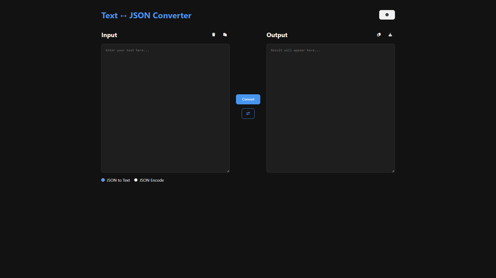

# Text ↔ JSON Converter

A modern web application for converting between plain text and JSON format with a clean, responsive interface and dark/light theme support.

📸 Screenshot

## Features

- **Text to JSON Conversion**: Convert plain text to a structured JSON format
- **JSON to Text Conversion**: Extract text content from JSON or pretty-print JSON
- **Theme Support**: Switch between light and dark themes
- **Conversion History**: View and manage your past conversions
- **Clipboard Integration**: Copy/paste functionality
- **File Download**: Save conversions as text or JSON files
- **JSON Formatting Options**: Pretty print and Unicode escaping options
- **Responsive Design**: Works on desktop and mobile devices

## Technologies Used

- HTML5, CSS3, JavaScript (ES6)
- [Animate.css](https://animate.style/) for animations
- [AOS (Animate On Scroll)](https://michalsnik.github.io/aos/) for scroll animations
- [Font Awesome](https://fontawesome.com/) for icons
- [Google Fonts](https://fonts.google.com/) (Inter font family)
- LocalStorage for theme preference and history persistence

## Installation

No installation required! Simply open the `index.html` file in your browser.

## Usage

1. Enter your text or JSON in the input area
2. Select the conversion direction (Text to JSON or JSON to Text)
3. Click the "Convert" button
4. View the result in the output area
5. Use the additional options like copy, download, or history as needed

## Customization

You can customize the app by modifying:

- Colors in the `:root` and `[data-theme="dark"]` CSS variables
- Animation durations in the AOS initialization
- Maximum history items in the `MAX_HISTORY_ITEMS` constant

## Browser Support

The app works on all modern browsers including:

- Chrome
- Firefox
- Safari
- Edge
- Opera

## License

This project is open source and available under the [MIT License](LICENSE).

## Contributing

Contributions are welcome! Please open an issue or submit a pull request for any improvements.
